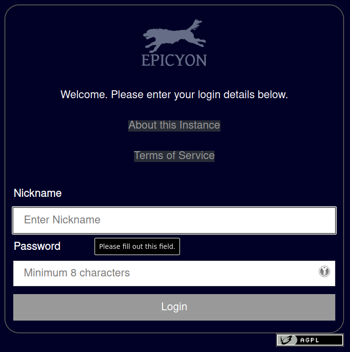
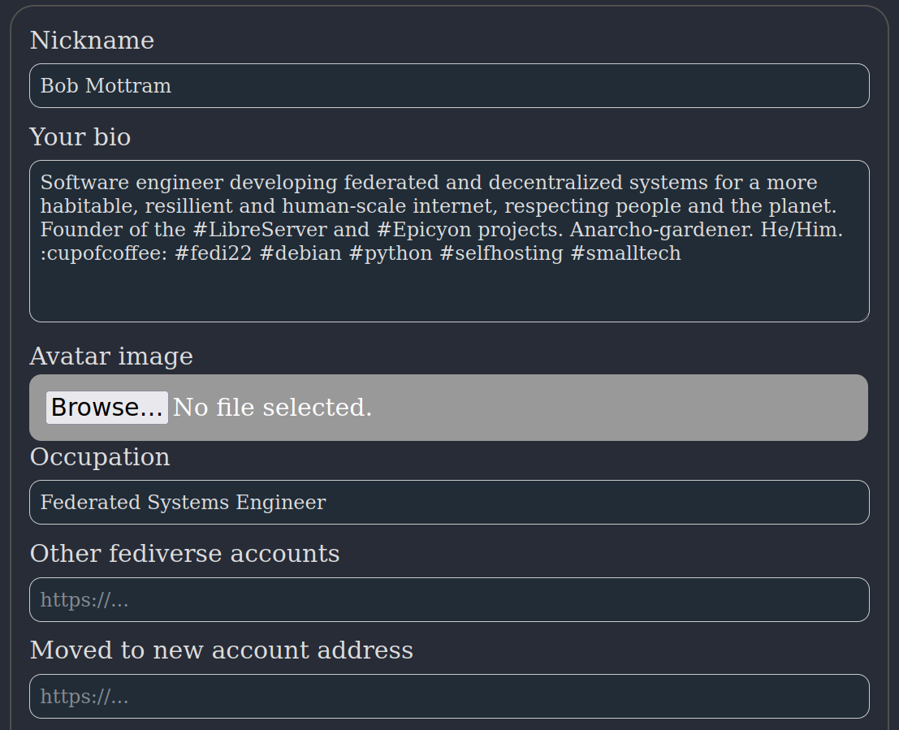
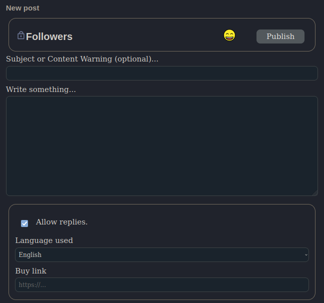
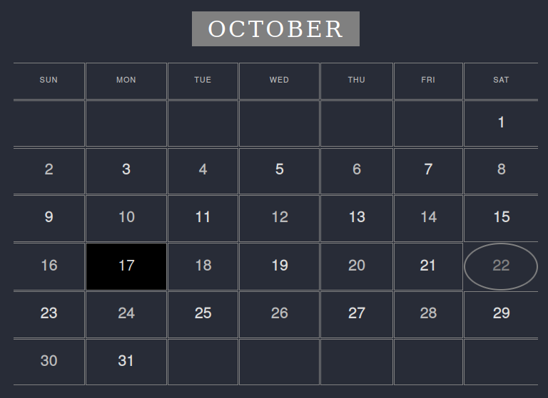
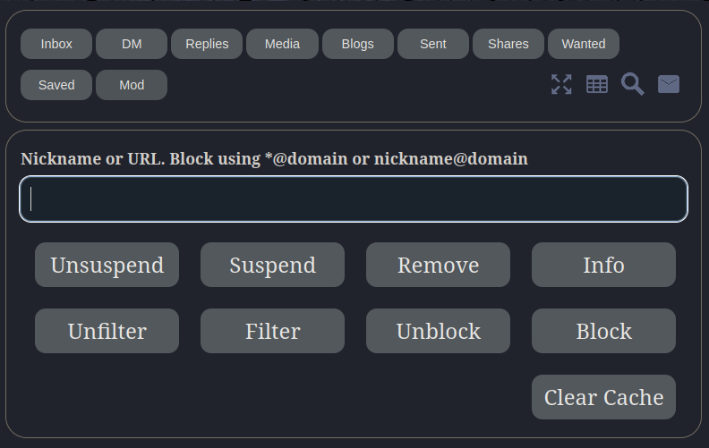
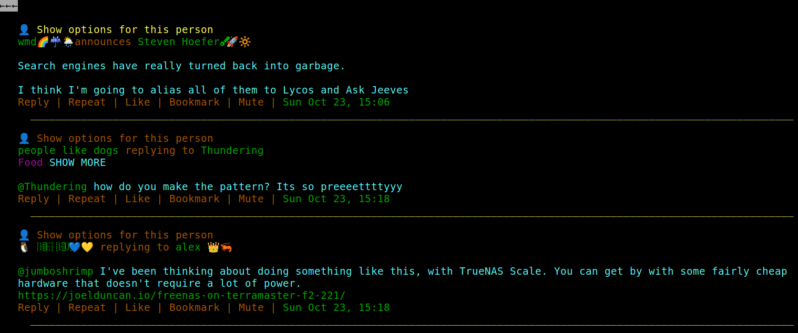

# Table of Contents
1. [Introduction](#introduction)
2. [Installation](#installation)
3. [Upgrading](#upgrading)
4. [Housekeeping](#housekeeping)
5. [Registering accounts](#registering-accounts)
6. [The importance of good defaults](#the-importance-of-good-defaults)
7. [Logging in](#logging-in)
8. [Account Profiles](#account-profiles)
9. [Following](#following)
10. [Creating posts](#creating-posts)
11. [The Timeline](#the-timeline)
12. [Calendar](#calendar)
13. [Side columns](#side-columns)
14. [Media timeline](#media-timeline)
15. [Moderation](#moderation)
16. [Themes](#themes)
17. [Sharing economy](#sharing-economy)
18. [Search](#search)
19. [Browsing in a command shell](#browsing-in-a-command-shell)
20. [Building fediverse communities](#building-fediverse-communities)

# Introduction
*"Every new beginning comes from some other beginning’s end."*

-- Seneca

*The fediverse* is a set of federated servers, typically using a communication protocol called [ActivityPub](https://www.w3.org/TR/activitypub) which was devised by the [social working group](https://www.w3.org/wiki/Socialwg) within the World Wide Web Consortium (W3C). At present it is mostly used for [microblogging](https://en.wikipedia.org/wiki/Microblogging), although ActivityPub is sufficiently general that it can also be used for a variety of other purposes.

The word *fediverse* (federated universe) appears to have originated around 2012 as the first [identi.ca](https://en.wikipedia.org/wiki/Identi.ca) website was ending and the [pump.io](https://en.wikipedia.org/wiki/Pump.io) project was beginning. The ActivityPub protocol was initially called *ActivityPump*, due to the influence which pump.io had upon its creation. Fediverse servers are typically referred to as "instances".

Servers such as [Mastodon](https://github.com/mastodon/mastodon) are well known, but these are aimed at large scale deployments on powerful hardware running within data centers, making use of content distribution networks (CDN) and due to their large number of dependencies requiring someone with a high level of systems administration skill to maintain. Epicyon is designed for the opposite situation where it is only intended to have a single user or a small number of users (less than ten) running from your home location or on a modest VPS and where maintenance is extremely trivial such that it's possible to keep an instance running for long durations with minimal intervention.

Epicyon is part of the [small web](https://neustadt.fr/essays/the-small-web) category of internet software, in that it is intended to scale via federation rather than to scale vertically via resource intensive and expensive hardware. Think many small communicating nodes rather than a small number of large servers. Also, in spite of the prevailing great obsession with scale, not everything needs to. You can federate with a small number of servers for a particular purpose - such as running a club or hackspace - and that's ok.

It is hardly possible to visit many sites on the web without your browser loading and running a large amount of javascript. Epicyon takes a minimalist approach where its web interface only uses [HTML](https://html.spec.whatwg.org/multipage) and [CSS](https://www.w3.org/Style/CSS/Overview.en.html). You can disable javascript, or use a browser which doesn't have javascript capability, and the user experience is unchanged. Lack of javascript also rules out a large area of potential attack surface.

Another common concern is being able to keep instances running. Instance abandonment creates a lot of disruption, and it's often related to the amount of effort that it takes to keep things going. To avoid the maintenance burden becoming prohibitive, Epicyon is implemented in a simple manner with very few dependencies and no database. All data is just files in a directory, and upgrades are also straightforward. This degree of simplicity runs counter to the current trend within the software industry towards complex frameworks and large scale databases with elaborate and rapidly evolving dependencies.

Epicyon also includes some lightweight organizing features, such as calendar, events and sharing economy features.

# Installation
## Prerequisites
You will need python version 3.7 or later.

On a Debian based system:
``` bash
sudo apt install -y tor python3-socks imagemagick python3-setuptools python3-cryptography python3-dateutil python3-idna python3-requests python3-flake8 python3-django-timezone-field python3-pyqrcode python3-png python3-bandit libimage-exiftool-perl certbot nginx wget
```
## Source code
The following instructions install Epicyon to the **/opt** directory. It's not essential that it be installed there, and it could be in any other preferred directory.

Clone the repo, or if you downloaded the tarball then extract it into the **/opt** directory.
```bash
cd /opt
git clone https://gitlab.com/bashrc2/epicyon
```
## Set permissions
Create a user for the server to run as:
```bash
sudo su
adduser --system --home=/opt/epicyon --group epicyon
chown -R epicyon:epicyon /opt/epicyon
```
## News mirrors
The content for RSS feed links can be downloaded and mirrored, so that even if the original sources go offline the content remains readable. Link the RSS/newswire mirrors with.
```bash
mkdir /var/www/YOUR_DOMAIN
mkdir -p /opt/epicyon/accounts/newsmirror
ln -s /opt/epicyon/accounts/newsmirror /var/www/YOUR_DOMAIN/newsmirror
```
## Create daemon
Typically the server will run from a *systemd* daemon. It can be set up as follows:
```bash
nano /etc/systemd/system/epicyon.service
```

Paste the following:
```bash
[Unit]
Description=epicyon
After=syslog.target
After=network.target

[Service]
Type=simple
User=epicyon
Group=epicyon
WorkingDirectory=/opt/epicyon
ExecStart=/usr/bin/python3 /opt/epicyon/epicyon.py --port 443 --proxy 7156 --domain YOUR_DOMAIN --registration open --debug --log_login_failures
Environment=USER=epicyon
Environment=PYTHONUNBUFFERED=true
Restart=always
StandardError=syslog
CPUQuota=80%
ProtectHome=true
ProtectKernelTunables=true
ProtectKernelModules=true
ProtectControlGroups=true
ProtectKernelLogs=true
ProtectHostname=true
ProtectClock=true
ProtectProc=invisible
ProcSubset=pid
PrivateTmp=true
PrivateUsers=true
PrivateDevices=true
PrivateIPC=true
MemoryDenyWriteExecute=true
NoNewPrivileges=true
LockPersonality=true
RestrictRealtime=true
RestrictSUIDSGID=true
RestrictNamespaces=true
SystemCallArchitectures=native

[Install]
WantedBy=multi-user.target
```

Activate the daemon:
```bash
systemctl enable epicyon
systemctl start epicyon
```
## Web server setup
Create a web server configuration.
```bash
nano /etc/nginx/sites-available/YOUR_DOMAIN
```

And paste the following:
```nginx
server {
  listen 80;
  listen [::]:80;
  server_name YOUR_DOMAIN;
  access_log /dev/null;
  error_log /dev/null;
  client_max_body_size 31m;
  client_body_buffer_size 128k;
  
  limit_conn conn_limit_per_ip 10;
  limit_req zone=req_limit_per_ip burst=10 nodelay;
  
  index index.html;
  rewrite ^ https://$server_name$request_uri? permanent;
}

server {
  listen 443 ssl;
  server_name YOUR_DOMAIN;
  
  gzip on;
  gzip_disable "msie6";
  gzip_vary on;
  gzip_proxied any;
  gzip_min_length 1024;
  gzip_comp_level 6;
  gzip_buffers 16 8k;
  gzip_http_version 1.1;
  gzip_types text/plain text/css text/vcard text/vcard+xml application/json application/ld+json application/javascript text/xml application/xml application/rdf+xml application/xml+rss text/javascript;
  
  ssl_stapling off;
  ssl_stapling_verify off;
  ssl on;
  ssl_certificate /etc/letsencrypt/live/YOUR_DOMAIN/fullchain.pem;
  ssl_certificate_key /etc/letsencrypt/live/YOUR_DOMAIN/privkey.pem;
  #ssl_dhparam /etc/ssl/certs/YOUR_DOMAIN.dhparam;
  
  ssl_protocols TLSv1.2 TLSv1.3;
  ssl_ciphers HIGH:!MEDIUM:!LOW:!aNULL:!NULL:!SHA;
  ssl_prefer_server_ciphers on;
  ssl_session_cache shared:SSL:10m;
  ssl_session_tickets off;
  
  add_header Content-Security-Policy "default-src https:; script-src https: 'unsafe-inline'; style-src https: 'unsafe-inline'";
  add_header X-Frame-Options DENY;
  add_header X-Content-Type-Options nosniff;
  add_header X-XSS-Protection "1; mode=block";
  add_header X-Download-Options noopen;
  add_header X-Permitted-Cross-Domain-Policies none;
  add_header Strict-Transport-Security "max-age=15768000; includeSubDomains; preload" always;
  
  access_log /dev/null;
  error_log /dev/null;
  
  index index.html;
  
  location /newsmirror {
    root /var/www/YOUR_DOMAIN;
    try_files $uri =404;
  }
  
  keepalive_timeout 70;
  sendfile on;
  
  location / {
  proxy_http_version 1.1;
  client_max_body_size 31M;
  proxy_set_header Host $http_host;
  proxy_set_header X-Real-IP $remote_addr;
  proxy_set_header X-Forward-For $proxy_add_x_forwarded_for;
  proxy_set_header X-Forward-Proto http;
  proxy_set_header X-Nginx-Proxy true;
  proxy_temp_file_write_size 64k;
  proxy_connect_timeout 10080s;
  proxy_send_timeout 10080;
  proxy_read_timeout 10080;
  proxy_buffer_size 64k;
  proxy_buffers 16 32k;
  proxy_busy_buffers_size 64k;
  proxy_redirect off;
  proxy_request_buffering off;
  proxy_buffering off;
  proxy_pass http://localhost:7156;
  tcp_nodelay on;
  }
}
```

Enable the site:
```bash
ln -s /etc/nginx/sites-available/YOUR_DOMAIN /etc/nginx/sites-enabled/
```

## On your internet router
Forward port 443 from your internet router to your server. If you have dynamic DNS make sure its configured.

## Obtain a TLS certificate
```bash
systemctl stop nginx
certbot certonly -n --server https://acme-v02.api.letsencrypt.org/directory --standalone -d YOUR_DOMAIN --renew-by-default --agree-tos --email YOUR_EMAIL
systemctl start nginx
```

## Restart the web server
```bash
systemctl restart nginx
```

If you need to use [fail2ban](https://www.fail2ban.org) then failed login attempts can be found in **accounts/loginfailures.log**.

If you are using the [Caddy web server](https://caddyserver.com) then see [caddy.example.conf](https://code.libreserver.org/bashrc/epicyon/raw/main/caddy.example.conf).

Now you can navigate to your domain and register an account. The first account becomes the administrator.

## Installing on Onion or i2p domains
If you don't have access to the clearnet, or prefer to avoid it, then it's possible to run an Epicyon instance easily from your laptop. There are scripts within the *deploy* directory which can be used to install an instance on a Debian or Arch/Parabola operating system. With some modification of package names they could be also used with other distros.

Please be aware that such installations will not federate with ordinary fediverse instances on the clearnet, unless those instances have been specially modified to do so. But onion instances will federate with other onion instances and i2p instances with other i2p instances.

# Upgrading
Unlike some other instance types, Epicyon is really easy to upgrade. It only requires a git pull to obtain the changes from the upstream repo, then set permissions and restart the daemon.
```bash
cd /opt/epicyon
git pull
chown -R epicyon:epicyon *
systemctl restart epicyon
```

# Housekeeping
To avoid running out of disk space you will want to clear down old inbox posts. Posts from your instance outboxes will be unaffected.

Create an archive script **/usr/bin/epicyon-archive**:
```bash
#!/bin/bash
cd /opt/epicyon || exit 0
/usr/bin/python3 epicyon.py --archive none --archiveweeks 4 --maxposts 32000
```

You can adjust the maximum number of weeks and the maximum number of inbox posts as needed. Then add it as a cron entry.
```bash
echo "*/60 * * * * root /usr/bin/epicyon-archive" >> /etc/crontab
```

# Registering accounts
You will notice that within the systemd daemon the *registration* option is set to *open*. In a browser if you navigate to the URL of your instance then you should see a *Register* button. The first account to register becomes the administrator.

To avoid spam signups, or overloading the system, there is a maximum number of accounts for the instance which by default is set to 10.

# The importance of good defaults
Many social network systems have bad defaults, and that is for the purpose of maximizing the number of users and their level of engagement. Bad defaults usually create a combination of *addiction patterns* and *involuntary oversharing* and hence a viral network effect of escalating outrage and dependency. On small fediverse servers we can avoid having bad defaults, because there is no profit motive or drive for massive notoriety.

Good defaults tend to be a little more private and avoid the addiction to making numbers go up or achieving *notoriety at any social cost*. This puts fediverse instances like Epicyon at a slight disadvantage compared to ruthlessly commercial systems, but it's an explicit trade-off in order to minimize the harms which can arise within social networks. So you won't find any high scores tables or trending items.

# Logging in
In a browser if you navigate to the URL of your instance and enter the username and password that you previously registered. The first time that you log in it will show a series of introduction screens which prompt you to add a profile picture, name and bio description.



# Account Profiles
## Initial setup
When you first register an account on the instance the first thing that you may want to do is to add more profile details and change your preferences. From the main timeline screen select the top banner to move to your profile and then select the edit button, which usually looks like a pen and is adjacent to the logout icon.


## Basic details


### Describe yourself
Add an appropriate description of youself, which doesn't resemble the type of thing which would appear on a spam account. When other fediverse users are judging a follow request from you they will want to know that you are a real person and not a spammer or troll.

### Other fediverse accounts
If you have any other fediverse accounts on different instances then you might want to add URLs for those. You can set the languages which you can read, as [two letter abbreviations](https://en.wikipedia.org/wiki/ISO_639-1). This helps to avoid having posts from other people within your timeline which you can't read.

### Expiring posts
You can set your posts to expire after a number of days. If this value is zero then the instance will keep your posts indefinitely.

### Quitting Twitter
If you are coming to the fediverse as an exile from Twitter then you may want to select the option to remove any Twitter posts from your timeline. Sometimes people want to make a clean break from Twitter and have no further involvement with it.

### Alternative contact details
You can set additional contact details, such as email, XMPP and Matrix addresses. So if people want to contact you for private [end-to-end secure](https://en.wikipedia.org/wiki/End-to-end_encryption) chat then they can do so. The fediverse was never designed for end-to-end security - it is primarily for public communications - and so it's better to leave secure private chat to the apps which are specialized for that purpose.

### Filtering and blocking
If you want to block particular fediverse accounts or instances then you can enter those in the *blocked account* section. There should be one account per line.

### Geolocation spoofing
Within the *filtering and blocking* section you can also set a city which will be used for geolocation spoofing. When you post a photo, instead of removing all metadata spoofed metadata will be added in order to consistently fool the machine learning systems behind web crawlers or scrapers, and create a [confirmation bias](https://en.wikipedia.org/wiki/Confirmation_bias) effect where the surveillance systems become increasingly confident in an erroneous conclusion. Setting a city somewhere near to your [time zone](https://en.wikipedia.org/wiki/Time_zone) is preferable, so that it matches your typical pattern of daily posting activity without giving away your real location.

## Roles
If you are the administrator then within your profile settings you can also specify roles for other accounts on the instance. A small instance is like a ship with the roles being crew positions, and all members of the crew need to work together to keep the ship afloat. The current roles are:

### Moderator
Is allowed to remove posts and deal with moderation reports.

### Editor
Editors can change the links in the left column and the RSS feeds within the right newswire column.

### Artist
Artists can change the colors and style of the web interface, using the *theme designer*.

### Counselor
A *counselor* is someone tasked with resolving disputes between users of the instance. They are permitted to send DMs to any user account on the instance. Obviously, this type of power can be abused and so the administrator should choose counselors with care.

### Devop
Devops are permitted to perform some routine administration functions, such as monitoring instance performance graphs.

# Following
On the main timeline screen at the top right of the centre column there is a search icon which looks like a magnifying glass. By convention within the fediverse the search function is also the way to look up and follow other people. Enter the handle (@name@domain) or URL of the profile page for the person that you want to follow and select *search*. If the account is found then its details will appear and you can choose to follow or not.


Once you are following someone then selecting their profile picture and then the *unfollow* button will remove the follow.

# Creating posts
To make a new post from the main timeline screen select the *new post* icon at the top right of the centre column.



The format of the post should be plain text, without any html markup. Any URLs will be automatically linked, and you can use hashtags and emoji. Emojis can be added via their name with colon characters before and after.

## Post scopes
Posts can have different scopes which provide some amount of privacy, or particular functions. To change the scope select the current one and a dropdown list will appear.

### Public
Is visible to anyone in the fediverse. May also be visible outside of the fediverse to anyone with an appropriate link.

### Blog
Used to create a blog post. Blog posts are typically longer than other types of post, and are also publicly visible to anyone on the web.

At the top of the *links* column on the main timeline screen there is an icon to show an RSS feed for your blog entries.

### Unlisted
Similar to a public post, but will not appear as a recent post within your profile. Unlisted posts can add a little more privacy to a conversation in that it will not be immediately obvious to casual observers. Often in practice this is all that's needed to avoid trolls or unwanted attention.

### Followers
A *followers only* post will only be visible to people who are following you. They will not be visible to people who are not your followers, or to other observers on the web.

A subtlety of this type of post is that people have different followers, so if you send to your followers and they send a reply to their followers then your post or references to it may end up with people who are not your followers.

### DM
Direct messages are only send to specific people, designated by their fediverse handles (@name@domain).

### Reminder
A reminder is a direct message to yourself at some time in the future. It will appear on your calendar.

### Report
A report is a type of post which is sent to moderators on your instance, to alert them about some problem. It is not sent to any other instance.

### Shares
A *shared item* post describes a physical object or service which may be shared by people on your instance. Shared items may also be visible to people on specific named instances if that has been set up by the administrator.

### Wanted
A *wanted item* is a physical object or service which you want. These posts will be visible to other people on your instance and also to people on specific named instances if that has been set up by the administrator.

## Attachments
Attachments can use a variety of formats.

 * Images: *jpg, jpeg, gif, webp, avif, svg, ico, jxl, png*
 * Audio: *mp3, ogg, flac, opus, speex, wav*
 * Video: *mp4, webm, ogv*


Attachments should be as small as possible in terms of file size. Videos should be no more than 20 seconds in length. Epicyon is not suitable for hosting lengthy or high resolution videos, although podcasts might be feasible.

## Events
You can specify a date, time and location for the post. If a date is set then the post will appear as an event on the calendar of recipients. This makes it easy for people to organize events without needing to explicitly manage calendars.


## Maps
The location field on a post can be a description, but it can also be a map geolocation. To add a geolocation go to [openstreetmap.org](https://www.openstreetmap.org), find your location and copy and paste the URL into the location field of your new post.

Selecting the *location* header will open the last known geolocation, so if your current location is near this makes it quicker to find. 

# The Timeline
## Layout


On a desktop system the main timeline screen has a multi-column layout. The main content containing posts is in the centre. To the left is a column containing useful web links. To the right is the newswire containing links from RSS feeds.

At the top right of the centre column there are a few icons known as *action buttons*, for show/hide, calendar, search and creating a new post.

On mobile screens there is a single column layout, and the *links* and *newswire* column content is available via action buttons.

Different timelines are listed at the top - inbox, DM, replies, outbox, etc - and more can be shown by selecting the *show/hide* icon.

## Navigation
As a general principle of navigation selecting the top banner always takes you back to the previous screen, or if you are on the main timeline screen then it will alternate with your profile.

At the bottom of the timeline there will usually be an arrow icon to go to the next page, and a list of page numbers. You can also move between pages using key shortcuts **ALT+SHIFT+>** and **ALT+SHIFT+<**. Key shortcuts exist for most navigation events, and you can customise them by selecting the *key shortcuts* link at the bottom of the left column.


# Calendar
The calendar is not yet a standardized feature of the fediverse as a whole, but has existed in Friendica and Zot instances for a long time. Being able to attach a date and time to a post and then have it appear on your calendar and perhaps also the calendars of your followers is quite useful for organizing things with minimum effort. Until such time as federated calendar functionality becomes more standardized this may only work between Epicyon instances.

Calendar events are really just ordinary posts with a date, time and perhaps also a location attached to them. Posts with *Public* scope which have a date and time will appear on the calendars of your followers, unless they have opted out of receiving calendar events from you.



*Reminder* is a special type of calendar post, which is really just a direct message to yourself in the future.

To create a calendar post from the main timeline, select the **New post** icon, then use the dropdown menu to select the scope of your post. Give your event a description and add a date and time. If you add a location this can either be a description or a geolocation link, such as a link to [openstreetmap](https://openstreetmap.org).

Selecting the calendar icon from the main timeline will display your calendar events. It is possible to export them using the **iCalendar** icon at the bottom right to the screen. Calendar events are also available via [CalDav](https://en.wikipedia.org/wiki/CalDAV) using the URL https://yourdomain/calendars/yournickname

# Side columns

The links within the side columns are global to the instance, and only users having the *editor* role can change them. Since the number of accounts on the instance is expected to be small these links provide a common point of reference.

This multi-column layout is inspired by the appearance of early blogs or the original *Indymedia*, which in turn was inspired by the appearance of monastic texts in which you would see comments in the margins in line with the main text. So you can be reading posts from friends but also keeping an eye on the news from RSS/Atom feeds at the same time.

## Links
Web links within the left column are intended to be generally useful or of interest to the users of the instance. They are similar to a blogroll. If you have the *editor* role there is an edit button at the top of the left column which can be used to add or remove links. Headers can also be added to group links into logical sections. For example:
```text
* Search

Code search https://beta.sayhello.so
Wiby https://wiby.me/

* Links

16colors https://16colo.rs
Dotshareit http://dotshare.it
```

## Newswire
The right column is the newswire column. It contains a list of links generated from RSS/Atom feeds.

[RSS](https://en.wikipedia.org/wiki/RSS) is a much maligned protocol. It's simple, and an excellent way to read news in a manner that's convenient for you. The main reason for its downfall is that it's difficult to implement [targeted advertising](https://en.wikipedia.org/wiki/Surveillance_capitalism) - the dominant business model of the web - within RSS. It's hard to spy on anyone using an RSS feed. So if we want the web to improve then supporting RSS ought to be a priority.

If you have the *editor* role then an edit icon will appear at the top of the right column, and the edit screen then allows you to add or remove feeds.

### Moderated feeds
Feeds can be either *moderated* or not. Moderated feed items must be approved by a moderator before then can appear in the newswire column and be visible to other users on the instance. To indicate that a feed should be moderated prefix its URL with a star character.

### Mirrored feeds
Newswire items can also be mirrored. This means that instead of newswire items being links back to the original source article a copy will be made of the article locally on your server. Mirroring can be useful if the site of the RSS/Atom feed is unreliable or likely to go offline (such as solar powered systems only online during daylight hours). When deciding whether to mirror a feed you will also want to consider the copyright status of the content being mirrored, and whether legal problems could arise. To indicate that a feed should be mirrored prefix its URL with an exclamation mark ! character.

### Filters and warnings
On this screen you can also set filtered words and dogwhistle content warnings for the instance. Filtered words should be on separate lines, and dogwhistle words can be added in the format:
```text
dogwhistleword -> content warning to be added
dogwhistle phrase -> content warning to be added
DogwhistleWordPrefix* -> content warning to be added
*DogwhistleWordEnding -> content warning to be added
```

### Newswire tagging rules
As news arrives via RSS or Atom feeds it can be processed to add or remove hashtags, in accordance to some rules which you can define.

On the newswire edit screen, available to accounts having the *moderator* role, you can define the news processing rules. There is one rule per line.

**Syntax:** *if [conditions] then [action]*

**Logical Operators:** *not, and, or, xor, from, contains*

A simple example is:
```test
if moderated and not #oxfordimc then block
```

For moderated feeds this will only allow items through if they have the **#oxfordimc** hashtag.

If you want to add hashtags an example is:
```test
if contains "garden" or contains "lawn" then add #gardening
```

So if incoming news contains the word "garden" either in its title or description then it will automatically be assigned the hashtag **#gardening**. You can also add hashtags based upon other hashtags.
```test
if #garden or #lawn then add #gardening
```

You can also remove hashtags.
```test
if #garden or #lawn then remove #gardening
```

Which will remove **#gardening** if it exists as a hashtag within the news post.

You can add tags based upon the RSS link, such as:
```test
if from "mycatsite.com" then add #cats
```

# Media timeline
Selecting the *show/hide* icon from the main timeline will reveal an extra timeline called **Media**. The media timeline shows posts which contain a picture, audio or video content. So if you are primarily interested in photos then this timeline can be useful.


If there is an description for the media then this also appears within this timeline. Selecting a photo will enlarge it.

# Moderation
The importance of moderation within social networks can't be over-stated. In the early history of the web in which communities tended to be organized around forum software and mailing lists the typical pattern went as follows:

 * Founders initiate the forum
 * The forum gains popularity and a community grows around it
 * Trolls show up
 * The administrator is too nice, believes that all opinions are equally valid, and refuses to remove trolls or promptly redact their content
 * Within somewhere between a couple of days and a few weeks, trolls set longstanding forum members against each other
 * Community fails and the forum closes abruptly, leaving only a 404

The pattern has been repeated many times. Online communities can take years to carefully build up and days to destroy. Having good moderation in place, with clear terms of service and enforced boundaries, can help to avoid failures or burnout. Being "nice" and accepting all content tends not to work out well. Such an arrangement is easily hijacked by people with bad intent.

## Moderator timeline
If you have the *moderator* role then selecting the *show/hide* icon from the main timeline will reveal an extra timeline usually called **Mod**. Selecting this timeline will take you to the instance moderator timeline, which contains any moderation reports.



### Filtering
You can filter out posts containing particular words or phrases by entering the offending text and then selecting the **Filter** button. You can use the **Unfilter** button to reverse the decision.

### Removing an offending post
If a post made on your instance has been reported as violating the terms of service you can remove it by entering its URL and then selecting the **Remove** button.

### Suspending an account
You can suspend an account on the instance by entering the nickname and then selecting the **Suspend** button. Accounts are usually suspended pending investigation into some terms of service violation. You can use the **Unsuspend** button to re-enable an account.

### Instance level blocking
To block a fediverse handle (nickname@domain), hashtag or domain enter the thing that you wish to block and then select the **Block** button. You can do the same with the **Unblock** button to reverse your decision.

If you want to see what is being blocked at the instance level then select the **Info** button.

### Web crawlers and search bots
Most fediverse posts have *Public* scope, and various web crawlers routinely try to index them. These are mostly the usual suspects, such as BigTech companies, but also include lesser known crawlers such as the British Library. By default all web search bots are blocked, but the administrator account can enable particular ones.

If you are the administrator of the instance then to see the currently active web search crawlers edit your profile and select **Filtering and blocking**, then **Known Web Search Bots**. The most common ones will appear at the top. To enable particular ones add their name to **Web Search Bots Allowed** (one per line).

## Account level moderation
### Filtering
From the main timeline select the top banner to go to your profile, then select the **edit** icon. Open the **Filtering and blocking** section and then you can specify filtered words or phrases. Be sure to select **Publish** to finalize your settings.

You can also filter words within the bio of users making follow requests. This allows unwanted followers to be automatically rejected if their bio contains particular words.

### Blocking accounts or domains
From the main timeline select the top banner to go to your profile, then select the **edit** icon. Open the **Filtering and blocking** section and then you can specify blocked accounts or domains (one per line). Be sure to select **Publish** to finalize your settings.

### Replacing words
Sometimes you may want to replace words within received posts. This can be for added clarity, to dissipate annoyance or just for fun.

From the main timeline select the top banner to go to your profile, then select the **edit** icon. Open the **Filtering and blocking** section and then you can specify replacements as follows:
```text
OldWord -> NewWord
original phrase -> new phrase
```

These replacements are subjective, such that if you boost/repeat/announce a post then the original wording will be retained for recipients.

### Content warning lists
Content warning lists are lists of domains and/or keywords which can be used to append a warning if they appear in the content of an incoming post. For example, you can have a content warning added if a post contains links to satire sites, so that you don't confuse them with real news and you don't need to be familiar with every possible satire site. These types of warnings are opt-in, so if they don't apply to you then you don't have to have any.

From the main timeline select the top banner to go to your profile, then select the **edit** icon. Open the **Filtering and blocking** section and look for **"Add content warnings for the following sites"**. You can then select the types of warnings to be added to your timeline.

## Emergencies
The fediverse is typically calmer than the centralized social networks, but there can be times when disputes break out and tempers become heated. In the worst cases this can lead to administrator burnout and instances shutting down.

If you are the administrator and you are in a situation where you or the users on your instance are getting a lot of targeted harassement then you can put the instance into *broch mode*, which is a type of temporary allowlist which lasts for between one and two weeks. This prevents previously unknown instances from sending posts to your timelines, so adversaries can't create a lot of temporary instances for the purpose of attacking yours.

A general observation is that it is difficult to maintain collective outrage at a high level for more than a week, so trolling campaigns tend to not last much longer than that. Broch mode allows you to ride out the storm, while retaining normal communications with friendly instances.

To enable broch mode the administrator should edit their profile, go to the instance settings and select the option. Once enabled it will turn itself off automatically after 7-14 days. The somewhat uncertain deactivation time prevents an adversary from knowing when to begin a new flooding attempt, and after a couple of weeks they will be losing the motivation to continue.

# Themes
Generic-looking user interfaces have become expected for many types of software, because they are designed to scale up to very large numbers of users and hence need to be as bland and inoffensive as possible. But small web systems don't need appeal to a bland, corporate, imagined average user. If you are spending significant time using a social network then being able to customise it and really make it your online home improves usability.

## Standard themes
Epicyon has multiple standard themes and if you are the administrator then if you edit your profile and open the *Graphic design* section then you can change the current theme for the instance. Users may need to reload the web page with *CTRL+F5* in order to see the changes.

## Theme customization
If you have the *artist* role then from the top of the left column of the main timeline you can select the *Theme Designer* icon, which usually resembles a paint roller or paint brush. This allows you to change colors and values for user interface components. 


# Sharing economy
This is intended to add [Freecycle](https://en.wikipedia.org/wiki/The_Freecycle_Network) type functionality within a social network context, leveraging your social connections on the instance, or between participating instances, to facilitate sharing and reduce wasteful consumerism.

## Adding a shared item
When creating a new post one of the scope options is called *shares*. You can describe an item or service that you are willing to share.

Sharing is primarily intended to not require any monetary transactions, although prices can optionally be added. There are no payment mechanisms implemented and if that is required then it is recommended to include details of payment method within the description.


## Adding a wanted item
This is the opposite to adding a share in that you are making a post which indicates that you are wanting some particular thing or service.

## New shares
When new shared items are added then in the left column of the main timeline screen there will be a section showing recent shares.

## Shared and wanted items timelines
Any items shared or wanted will appear within timelines, which can be viewed by selecting the *show/hide* icon.

## Federated shares
If you are the administrator of the instance then you can specify other instances with which your local shared items may be federated. Edit your profile and select the *Shares* section, then add the domain names of the instances to share with (one per line). If other instance administrators also configure their system to share with yours then this is the ideal mutualistic situation, increasing the set of things being shared.

The technical implementation of federated shared items currently does not use ActivityPub, but instead a pull-based system more comparable to RSS/Atom. This is so that the people doing the sharing always remain in control of what they are sharing, and can withdraw a share at any time. A pull-based implementation also makes things considerably harder for spammers.

# Search
To search, select the magnifying glass icon from the top right of the centre column of the main timeline. This will take you to a separate screen where you can enter your search query.


**Hashtag categories**

If you select *SHOW MORE* at the bottom of the search screen then this will show all recent hashtags, in alphabetical order. If you have the *editor* role then selecting a tag will then allow to to assign a category to it. In this way you can build up *hashtag categories* as a way to group tags together under subject headings. For example, *cake* might be under a *food* category.

The hashtag categories are published as an RSS feed at https://yourdomain/categories.xml, and editors on other instances can add those feeds to their newswire. This enables the categorization of hashtags to be crowdsourced between instances.

**Searching for a fediverse handle or profile URL**

If you enter a fediverse handle or a URL corresponding to a profile then the system will try to find it. If successful then a summary of the found profile will be shown, and you will have the option to follow/unfollow or view the original upstream profile page. If you are already following then a different screen will be shown with more options available.

**Searching your posts**

To search your own posts prefix the search text with a single quote character.

**Searching hashtags**

To search for a hashtag just enter it, complete with the hash prefix.

**Searching shared items**

To search for any shared items just enter the text that you want to search for.

**Searching wanted items**

To search for a wanted item then enter the text that you want to search for prefixed by a full stop (period) character.

**Searching for skills**

To search for accounts having a particular skill, prefix your search text with a star character.

**Searching for emojis**

To search for an emoji use its name prefixed by a colon character.

# Browsing in a command shell
Since the web interface of Epicyon only needs HTML5 and CSS, it can work with browsers which don't implement javascript at all.

Screenshots within the preceding sections all assume that you are using a common graphical web browser. However, it is also possible to use Epicyon from a shell browser, such as [Lynx](https://lynx.invisible-island.net). This may be better suited for use with screen readers, or if you want to check your social media while logged into a server via *ssh*.

If you are using *Lynx* then you will need to ensure that it is configured for the **utf-8** character set, and that you have emoji fonts installed (eg. **noto-fonts-emoji**). Edit your *lynx.cfg* file (usually in */etc/lynx.cfg*) and set:
```text
CHARACTER_SET:utf-8
```

To avoid annoying questions you may also want to set:
```text
ACCEPT_ALL_COOKIES:TRUE
```

After logging in you will see a menu, which are shortcuts to different screens.


Timelines will look something like the following.



# Building fediverse communities
The great thing about running a small instance is that you can do things in whatever manner you prefer. What follows is a few guidelines which may help.


**Have a working backup system**

Keeping backups is very important, and fortunately with Epicyon this is a simple process. The Epicyon installation consists only of files in a directory. There is no database. So just backing up the directory where it resides - typically */opt/epicyon* - is all that you need to do. Once you have a backup system in place, test that it works.

**The fediverse is not an open source Twitter**

This sounds like a trite comment, but if you have members on your instance coming from Twitter and expecting it to be the same sort of thing then they will be disappointed. A major difference is that the fediverse is more about conversation rather than one-way broadcast. Sites like Twitter encourage you to become an "influencer" and adopt a style of communication where you are shouting to a large audience without much expectation of dialogue.

On Twitter there is an algorithm which will make follow suggestions and dump all manner of aggravating trash into your timeline. On the fediverse if you want to connect with people then you will need to be more proactive in going out to *find the others*. There is no algorithm trying to guess what you want without your participation.

**Robustly remove bad actors**

If people are creating a problem or bringing trouble and are not amenable to changing their ways, whether they are members of your instance or not, then be prepared to block or suspend their accounts. Remember that *trolls will destroy your community if you let them*. Define your *terms of service* and apply it consistently to anyone interacting with your instance.

**Curate your experience**

Add links to the left column and blog or podcast feeds to the right. Choose links which are relevant to your community so that useful information is one click away. If you have multiple people on your instance then assign roles to them so that they have a stake in maintaining a good experience.
